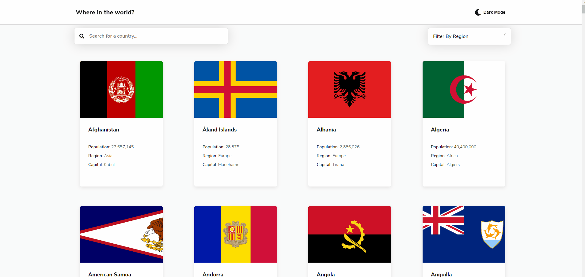

# Countries
## https://countries-tanzeel.vercel.app/

## Challenge from 'Front End Mentor'. 
### https://www.frontendmentor.io/challenges/rest-countries-api-with-color-theme-switcher-5cacc469fec04111f7b848ca/hub/rest-countries-api-with-color-theme-switcher-rTJuFkhqm

## Functionality

The home page displays a card for each country along with some basic information about the country. To view more detailed information about the country, click its card. 

### Searching

Enter the name of the country you want to search for in the search bar. Search results update after every keystroke.

### Filtering

Countries can be filtered by region. To select a region, click on 'Filter by Region' and select a region. Once a region has been selected, a new region can be selected by clicking that, or the filter can be removed by selecting the currently selected filter. Search and Filter work together.

### Dark Mode

Dark Mode and Day Mode can be switched between by clicking on the Dark/Day Mode button in the header. Dark mode preference persists between pages and sessions as it is stored locally.

## Technical

### Technologies Used:
React - Front end library 
Next.js - React framework 
Emotion - Styling 
axios - Data fetching 
FontAwesome - Icons for navigation and buttons 

Next.js was chose instead of Create React App since the project lent itself particularly well to static site generation, and to practice the framework. 

Dark Mode is implemented manually through the context API. Emotion offers theme support out of the box but the choice to implement themes manually was a deliberate one, to get a deeper understanding of how themes work.

Data for the countries is fetched from the REST Countries API (https://restcountries.eu/). REST Countries has an open API with no keys. 

For Styles, Emotion was chosen to localize styling within components, but with greater flexibility in terms of how to approach styling, compared to that offered by Styled Components, the alternative.